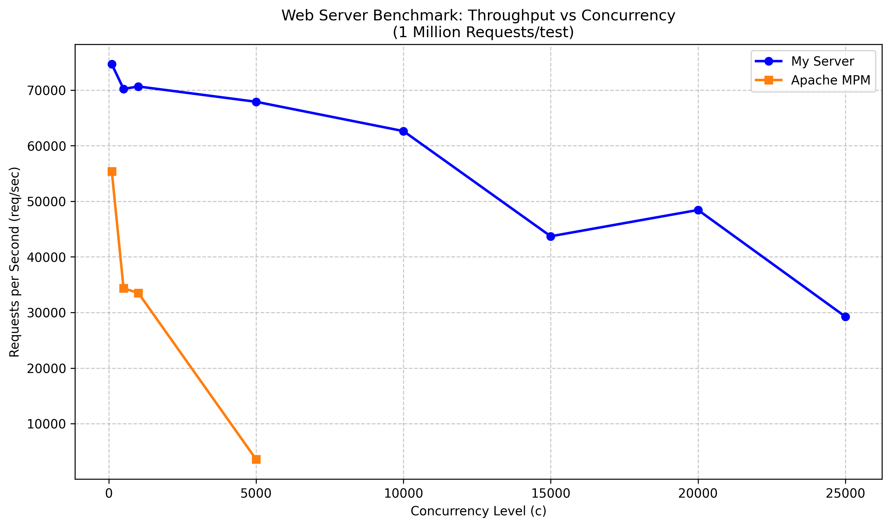
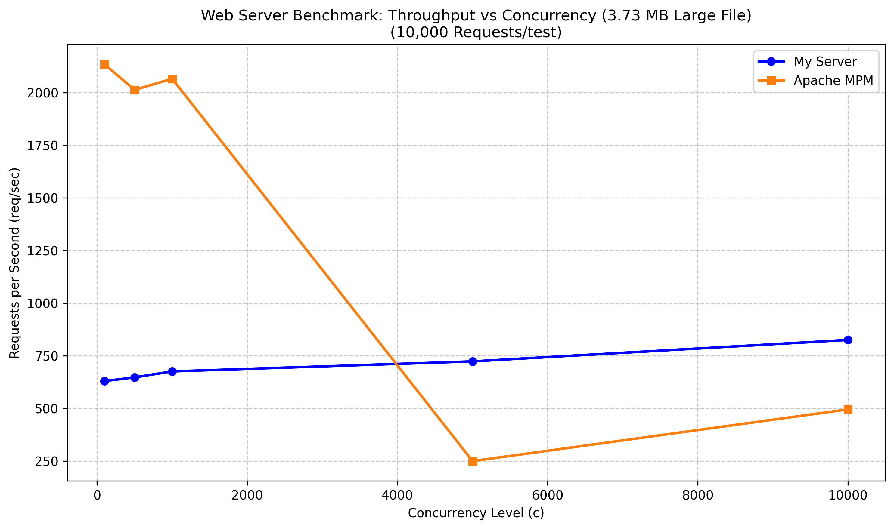
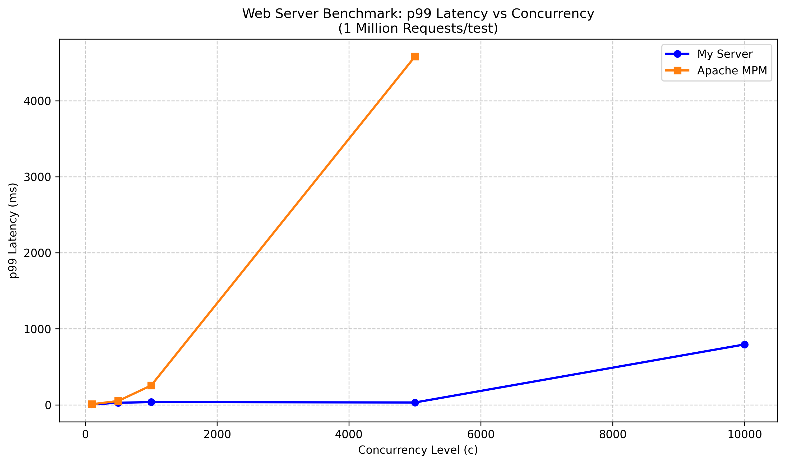

# C++ HTTP/HTTPS High-Performance Server

A High-Performance HTTP/HTTPS server written from scratch in C++ (23), built directly on the Windows networking stack and OpenSSL( for TLS ).

The server implements its own HTTP request parser, thread pool, resource-level locking mechanism, HTTP method handling, file caching system and RFC specifications, without relying on an HTTP server framework.

It is designed with performance and concurrency in mind, Performance was evaluated against Apache HTTP Server using MPM, with the server reaching approximately 70k requests/sec in local benchmarks under specific Stress-test conditions.

The project also includes HTTPS/TLS support, request validation, concurrent request handling, file serving, caching, unit tests, integration testing, and performance benchmarks.


## Features 

* **HTTP/1.x Support** — Custom implementation of HTTP/1.x request parsing, validation, and method handling.

* **HTTPS Support** — TLS-secured HTTP using OpenSSL, integrated into the same request-processing pipeline.

* **Persistent Connections** — Supports HTTP/1.x keep-alive connections, allowing multiple requests to be processed over the same TCP connection.

* **Static File Serving** — Serves files directly from the configured server directory with MIME type detection and HTTP response handling.

* **Custom HTTP Parser** — O(n) request parsing and validation with fewer than two full passes over the request data.

* **Custom Thread Pool** — Empirically tuned thread count to balance blocking I/O latency against CPU context-switching overhead.

* **Resource-Level Locking** — Custom lock management with efficient resource indexing and shared/exclusive locking for concurrent access.

* **File Caching** — Lazily caches file contents after the first access, reducing repeated filesystem I/O and significantly improving throughput for frequently     requested resources.

* **Concurrent Request Handling** — Designed to efficiently handle large numbers of simultaneous connections and requests.

* **Asynchronous Logging** — Dedicated logging mechanism to keep logging overhead away from request-processing threads.

* **Request Validation & Limits** — Validation of methods, headers, paths, request sizes, and other HTTP request constraints.

* **Request Security** - Defenses against malformed and ambiguous requests, including path traversal/Windows path quirks, percent-encoding issues, conflicting headers, oversized headers, and slow header attacks (Slowloris-style) and more.

* **Testing & Benchmarking** — Unit tests, integration/stress tests, and performance benchmarks against Apache HTTP Server (mpm).


## Architecture


                         Incoming Connection
                                │
                    ┌───────────┴───────────┐
                    │                       │
                    ▼                       ▼
             HTTP Socket              HTTPS Socket
                :8080                   :4040
                    │                       │
                    ▼                       ▼
             HTTP Accept Loop        HTTPS Accept Loop
                    │                       │
                    └───────────┬───────────┘
                                │
                                ▼
                    ┌─────────────────────┐
                    │     Thread Pool      │
                    │                       │
                    │  ┌────┐ ┌────┐ ┌────┐ │
                    │  │ T1 │ │ T2 │ │ T3 │ │
                    │  └────┘ └────┘ └────┘ │
                    │        ...            │
                    └──────────┬────────────┘
                               │
                               ▼
                     One Worker Picks
                       Up the Request
                               │
                               ▼
                    ┌─────────────────────┐
                    │   Receive Request    │
                    └──────────┬──────────┘
                               │
                               ▼
                    ┌─────────────────────┐
                    │    HTTP Parser       │
                    │ Parse + Validate     │
                    └──────────┬──────────┘
                               │
                               ▼
                         ┌───────────┐
                         │  Valid?   │
                         └─────┬─────┘
                          No   │   Yes
                               │
                 ┌─────────────┘
                 │
                 ▼
        ┌────────────────────┐             ┌────────────────────┐
        │   Reject Request   │             │   Method Handler   │
        │   HTTP Error       │             │ GET / HEAD / etc.  │
        └─────────┬──────────┘             └──────────┬─────────┘
                  │                                   │
                  │                                   ▼
                  │                            ┌──────────────┐
                  │                            │ File Cached? │
                  │                            └──────┬───────┘
                  │                              Yes │ No
                  │                                  │
                  │                    ┌─────────────┴─────────────┐
                  │                    ▼                           ▼
                  │              ┌──────────┐              ┌────────────┐
                  │              │  Cache   │              │    Disk    │
                  │              │  Memory  │              │ Read File  │
                  │              └────┬─────┘              └─────┬──────┘
                  │                   │                          │
                  │                   │                          ▼
                  │                   │                   ┌────────────┐
                  │                   │                   │ Cache File │
                  │                   │                   └─────┬──────┘
                  │                   │                          │
                  │                   └──────────┬───────────────┘
                  │                              │
                  └──────────────────────────────┤
                                                 ▼
                                      ┌────────────────────┐
                                      │   HTTP Response    │
                                      └─────────┬──────────┘
                                                │
                                                ▼
                                             Client


## Technical Highlights & Key Engineering Patterns

### Request Handling
 Each accepted connection is assigned to a worker from the thread pool. The worker receives the request until the HTTP header terminator (\r\n\r\n) is found, then passes the accumulated request through a custom parsing pipeline that extracts the method, URL, HTTP version, headers, and body.

 The parser advances through the request instead of repeatedly reparsing previously processed data, keeping request parsing O(n). After parsing, the request is validated before dispatching it to the corresponding HTTP method handler.

 HTTP/1.1 persistent connections are supported, allowing the same worker to process multiple requests over an established connection. HTTP/1.0 connections are closed after the request.

The parser is designed to be easily extended with additional header support.

### Concurrency Model
 The server uses a custom thread pool designed specifically around the blocking nature of its workload. Benchmarking showed that worker threads spend a significant portion of their lifetime blocked in operations such as receiving network data and transmitting files, so the pool intentionally maintains more workers than the number of hardware threads.

 The current configuration uses 50 × std::thread::hardware_concurrency() workers. This factor was selected empirically after testing different multipliers, balancing reduced idle time during blocking operations against excessive thread interleaving and context-switching overhead. Workers sleep on a condition variable when no tasks are available and execute requests independently once work is queued.

### Resource-Level Locking
 Shared files are protected using resource-level locks rather than a single global file lock. Each resource maps to its own std::shared_mutex, allowing independent files to be accessed concurrently without unnecessarily blocking unrelated requests.

 Efficient lock indexing — Resource locks are indexed using bitwise operations instead of modulo when mapping resources to lock slots, reducing the cost of lock lookup.

 Read-only operations such as GET and HEAD acquire shared locks, allowing multiple readers to access the same resource simultaneously. Operations that modify a resource, including PUT, POST, and DELETE, acquire exclusive locks to prevent concurrent modification and inconsistent file/cache state.

### File Caching
 Frequently requested files are cached lazily in memory after their first access. Each cache entry stores both the file contents and its detected MIME type, allowing subsequent requests to avoid reopening and rereading the file from disk.

 The cache itself is protected by a shared mutex: concurrent lookups can proceed using shared access, while insertions and invalidations acquire exclusive access. Modifying requests invalidate the corresponding cached entry to prevent stale data from being served.

### HTTP/HTTPS & TLS
 HTTP and HTTPS share the same request-processing and method-handling pipeline. The networking layer abstracts receiving and sending data through netRecv and netSend, which select between Winsock operations and OpenSSL's SSL_read/SSL_write depending on whether the connection is secured by TLS.

 HTTPS connections perform a TLS handshake before entering the normal request-processing loop, allowing the HTTP layer to remain independent of the underlying transport. The server creates a shared OpenSSL TLS context and loads the configured certificate and private key for incoming HTTPS connections.

### Request Validation & Security
 Requests are validated after parsing and before method dispatch. The validation layer checks the HTTP version, Host header, method, transfer encoding, Content-Length, and Expect handling.

 The URL parser additionally rejects several dangerous or ambiguous Windows path forms, including traversal patterns, UNC-style paths, invalid percent-encoded sequences, trailing dots/spaces, and paths containing a colon. Header accumulation is bounded and timed to limit oversized-header and slow-header attacks(Slowloris-style attacks are prevented).


## Performance & Benchmarks

The server was benchmarked under high-concurrency workloads and compared against
Apache HTTP Server using the MPM event architecture. The benchmarks focus on
throughput and tail latency across different concurrency levels.

*For benchmarking, it is recommended to build the `CacheNoLog` branch, which disables logging and avoids its overhead from affecting the measurements.*

### High-Concurrency Throughput

The server was tested with **1,000,000 requests per test** across increasing
concurrency levels. The server reached a peak throughput of approximately **74,000 requests/sec** at a concurrency level of 100.



The results show that the server maintains high throughput across a wide range of concurrency levels, reaching approximately **74,000 requests/sec** at peak before throughput begins to decline under extreme concurrency. Apache MPM shows a significantly larger throughput degradation as concurrency increases.

### Large-File Throughput

To evaluate the effect of file size and filesystem/network I/O, the server was
also tested using a **3.73 MB file** with **10,000 requests per test**.




### Tail Latency
p99 latency was measured across increasing concurrency levels using the
1,000,000-request workload.



The results show how latency changes as the server approaches higher levels
of concurrent load.


> Results are workload- and configuration-dependent. The benchmarks are intended to evaluate the implementation under the tested conditions rather than represent a general performance ranking.

### Benchmark Environment

- **OS:** Windows
- **Benchmark tool:** `hey`
- **Workload:** HTTP static-file requests
- **Concurrency:** ... adjustable
- **Requests:** ... adjustable
- **Caching:** ...
- **Apache MPM:** ... normal high performance config (mpm_event)
- **Build:** Release

## Quick Start

### Requirements

- **OS:** Windows
- **CMake:** 3.10 or newer
- **Compiler:** C++23-compatible compiler (MinGW-w64/GCC recommended)
- **Git:** Required to clone the repository
- **OpenSSL CLI:** Required to generate the TLS certificate and must be available through the `PATH` environment variable
- **hey:** Required only for integration/stress testing. `hey.exe` must be placed in the project's root directory.

OpenSSL libraries and headers, as well as doctest, are bundled with the repository and do not need to be installed separately.

           *The files to be served must be inside the content directory*

### TLS Certificate

 HTTPS requires a certificate and private key.

 Create the `cert` directory (in project's root directory) & Generate a self-signed certificate for local testing:

 ```bash
 mkdir cert
 openssl req -x509 -newkey rsa:2048 -keyout cert/server.key -out cert/server.crt -days 365 -nodes -subj "/CN=localhost"
 ```


 This creates:
 ```
 httpServer/cert/
                 ├── server.crt
                 └── server.key
 ```


### Build
```bash
 git clone https://github.com/Apdoxdd/HTTP-Server.git
 cd HTTP-Server

 cmake -S . -B build -G "MinGW Makefiles"
 cmake --build build
```
### Run
```bash
 cd build
 ./httpServer.exe
```


### Test with hey
 Place hey.exe in the project's root directory, then run:
 ```bash
python tests/integration/integration_test.py
```


## Limitations & Future Improvements

### Limitations

- **Windows-specific** — The current implementation relies on Windows networking APIs and is not portable to Linux or macOS.
- **HTTP/1.x only** — The server currently targets HTTP/1.x and does not support HTTP/2 or HTTP/3.
- **File-oriented** — The primary use case is serving and modifying files through HTTP methods; it is not intended to be a full-featured application server.
- **In-memory caching** — Cached files are stored in memory, which can increase memory usage when serving large or numerous resources.
- **Blocking I/O model** — Request processing relies on blocking network and file operations, requiring a larger worker pool to maintain throughput under high concurrency.
- **TLS configuration** — HTTPS currently relies on a locally configured certificate and key and does not provide automated certificate management.

### Future Improvements

- **IOCP-based Networking** — Replace the current blocking I/O model with Windows I/O Completion Ports (IOCP) to improve scalability under very high concurrency.
- **Cross-Platform Event-Driven I/O** — Introduce an event-driven networking backend such as `epoll` for Linux, while retaining IOCP for Windows.
- **HTTP/2 Support** — Extend the protocol layer beyond HTTP/1.x with HTTP/2 support and its multiplexed request model.
- **Expanded HTTP Support** — Add additional HTTP features and methods, including more complete RFC coverage.
- **Query Parameter Parsing** — Add structured parsing and handling of URL query parameters.
- **Chunked Transfer Encoding** — Add support for HTTP/1.1 chunked transfer encoding for requests and responses.
- **Advanced Cache Management** — Introduce configurable cache limits and eviction policies to better control memory usage.
- **Further Concurrency Optimization** — Revisit the thread scheduling and resource-locking architecture after introducing asynchronous I/O.